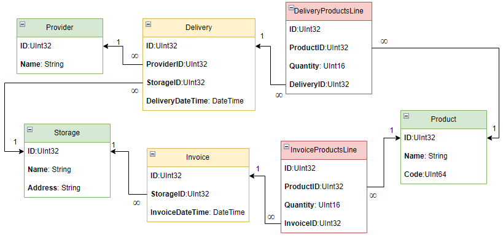

## Запуск скрипта

`docker-compose up --build`

Результат выполнения скрипта можно посмотреть в базе данных ClickHouse(стартует в докере).

[Connect dbeaver to Clickhouse](https://clickhouse.com/docs/en/integrations/sql-clients/dbeaver/)

## ShopDataGenerator

`ShopDataGenerator` - генератор данных для простой базы данных магазина. Наследуется от класса `DataGeneratorClickhouse`

## UML диаграмма БД:

## data_generator_executor.py

Скрипт для генерации данных в бд. Изначально выполняется при запуске docker-compose.

Чтобы не генерировать данные, нужно сменить флаг `GENERATE_DATA` на `False`.

Для запуска скрипта локально, нужно сменить переменную `HOST` на `localhost`

## setup_keyring.py

Пример использования [keyring](https://pypi.org/project/keyring/)
